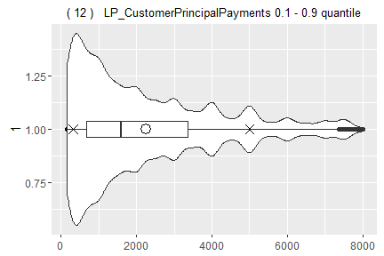
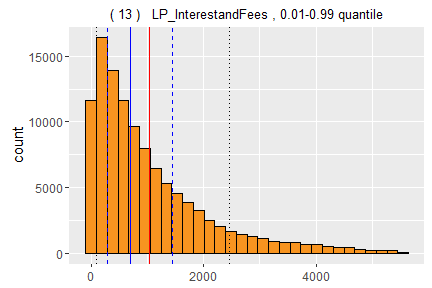
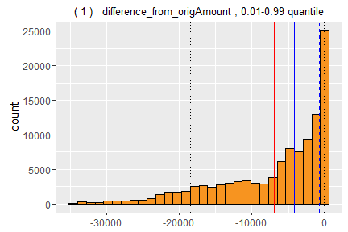

# Prosper - Exploratory data analysis with R
jaroslav klen  
January 14, 2016  


***

## Goal of analysis

***

Question, to which I would like to find answer with this exploratory data analysis, is if there are any input variables, which have a relationship to borrower's ability to repay loan?

***

#### Variable description

***

<https://www.prosper.com/Downloads/Services/Documentation/ProsperDataExport_Details.html>


***

## Dataset consistency and pre-investigations

***

This part is focused on examining structure of the dataset, characteristics and meanings of variables neccessary to perform analysis. Goal is to have dataset analysis-ready together with newly created variables, which provide us more information about loan listing or borrower. 2nd goal is finding or creating target variables, which express borrower's ability to repay loan, to which I would like to create regression model from input variables, if possible.


According to provided variables description, ListingKey, ListingNumber and LoanKey are all unique identifiers of each listing included in dataset. Lets check it.


Number of loans in whole dataset : 113937

Unique number of ListingKey: 113066

Unique number of ListingNumber: 113066

Unique number of LoanKey: 113066

Number of duplicated rows: 0

For purpose of further analysis, 871 duplicate listings (based on LisingKey) with higher row index were removed. For unknown reason, they differ on ProsperScore. Prior performing any analysis, we have to examine the structure of the dataset to be sure, that all variables are in proper format and if information they contain is consistent.


Summary of IncomeRange:


```
##             $0      $1-24,999      $100,000+ $25,000-49,999 $50,000-74,999 
##            621           7241          17188          31940          30749 
## $75,000-99,999  Not displayed   Not employed 
##          16780           7741            806
```

Summary of EmploymentStatus:


```
##                    Employed     Full-time Not available  Not employed 
##          2255         66598         26354          5347           835 
##         Other     Part-time       Retired Self-employed 
##          3742          1088           795          6052
```

Number of loans, which have IncomeRange and EmploymentStatus 'Not employed': 806

Category 'Not employed' in variable IncomeRange we can replace with NA, because this information is probably included in variable EmploymentStatus, for  category 'Not displayed' we have to create new variable called IncomeDisplayed with values 0 or 1 and replace it in original variable with NA. We have to change empty string and 'Not available' category in EmploymentStatus variable to NA too. Altough, these values could maybe reflect some changes of internal processes during loan listing evaluation, without knowing more information it is better this solution.

Since Prosper got through major changes in business model and its relaunch on July 2009, it might be possible, that I will use use these data only in further analysis, but for now, I will use all data.

Modified dataset structure:


```
## 'data.frame':	113066 obs. of  82 variables:
##  $ ListingKey                         : chr  "1021339766868145413AB3B" "10273602499503308B223C1" "0EE9337825851032864889A" "0EF5356002482715299901A" ...
##  $ ListingNumber                      : int  193129 1209647 81716 658116 909464 1074836 750899 768193 1023355 587746 ...
##  $ ListingCreationDate                : POSIXct, format: "2007-08-26 19:09:29" "2014-02-27 08:28:07" ...
##  $ CreditGrade                        : Ord.factor w/ 8 levels "AA"<"A"<"B"<"C"<..: 4 NA 7 NA NA NA NA NA NA NA ...
##  $ Term                               : Factor w/ 3 levels "12","36","60": 2 2 2 2 2 3 2 2 2 3 ...
##  $ LoanStatus                         : Ord.factor w/ 11 levels "Completed"<"FinalPaymentInProgress"<..: 1 3 1 3 3 3 3 3 3 3 ...
##  $ ClosedDate                         : POSIXct, format: "2009-08-14" NA ...
##  $ BorrowerAPR                        : num  0.165 0.12 0.283 0.125 0.246 ...
##  $ BorrowerRate                       : num  0.158 0.092 0.275 0.0974 0.2085 ...
##  $ LenderYield                        : num  0.138 0.082 0.24 0.0874 0.1985 ...
##  $ EstimatedEffectiveYield            : num  NA 0.0796 NA 0.0849 0.1832 ...
##  $ EstimatedLoss                      : num  NA 0.0249 NA 0.0249 0.0925 ...
##  $ EstimatedReturn                    : num  NA 0.0547 NA 0.06 0.0907 ...
##  $ ProsperRating_numeric              : Ord.factor w/ 7 levels "1"<"2"<"3"<"4"<..: NA 6 NA 6 3 5 2 4 7 4 ...
##  $ ProsperRating_alpha                : Ord.factor w/ 7 levels "AA"<"A"<"B"<"C"<..: NA 2 NA 2 5 3 6 4 1 4 ...
##  $ ProsperScore                       : Ord.factor w/ 11 levels "1"<"2"<"3"<"4"<..: NA 7 NA 9 4 10 2 4 9 7 ...
##  $ ListingCategory_numeric            : Factor w/ 21 levels "Not available",..: 1 3 1 17 3 2 2 3 8 2 ...
##  $ BorrowerState                      : Factor w/ 52 levels "","AK","AL","AR",..: 7 7 12 12 25 34 18 6 16 22 ...
##  $ Occupation                         : Factor w/ 68 levels "","Accountant/CPA",..: 37 43 37 52 21 43 50 29 24 22 ...
##  $ EmploymentStatus                   : Factor w/ 7 levels "Employed","Full-time",..: 7 1 NA 1 1 1 1 1 1 1 ...
##  $ EmploymentStatusDuration           : int  2 44 NA 113 44 82 172 103 269 300 ...
##  $ IsBorrowerHomeowner                : Factor w/ 2 levels "False","True": 2 1 1 2 2 2 1 1 2 1 ...
##  $ CurrentlyInGroup                   : Factor w/ 2 levels "False","True": 2 1 2 1 1 1 1 1 1 1 ...
##  $ GroupKey                           : Factor w/ 707 levels "","00343376901312423168731",..: 1 1 335 1 1 1 1 1 1 1 ...
##  $ DateCreditPulled                   : POSIXct, format: "2007-08-26 18:41:46" "2014-02-27 08:28:14" ...
##  $ CreditScoreRangeLower              : int  640 680 480 800 680 740 680 700 820 640 ...
##  $ CreditScoreRangeUpper              : int  659 699 499 819 699 759 699 719 839 659 ...
##  $ FirstRecordedCreditLine            : POSIXct, format: "2001-10-11" "1996-03-18" ...
##  $ CurrentCreditLines                 : Ord.factor w/ 54 levels "0"<"1"<"2"<"3"<..: 6 15 NA 6 20 22 11 7 18 3 ...
##  $ OpenCreditLines                    : Ord.factor w/ 52 levels "0"<"1"<"2"<"3"<..: 5 15 NA 6 20 18 8 7 17 3 ...
##  $ TotalCreditLinespast7years         : int  12 29 3 29 49 49 20 10 32 56 ...
##  $ OpenRevolvingAccounts              : Ord.factor w/ 48 levels "0"<"1"<"2"<"3"<..: 2 14 1 8 7 14 7 6 13 5 ...
##  $ OpenRevolvingMonthlyPayment        : num  24 389 0 115 220 1410 214 101 219 25 ...
##  $ InquiriesLast6Months               : Ord.factor w/ 50 levels "0"<"1"<"2"<"3"<..: 4 4 1 1 2 1 1 4 2 2 ...
##  $ TotalInquiries                     : Ord.factor w/ 102 levels "0"<"1"<"2"<"3"<..: 4 6 2 2 10 3 1 17 7 3 ...
##  $ CurrentDelinquencies               : Ord.factor w/ 47 levels "0"<"1"<"2"<"3"<..: 3 1 2 5 1 1 1 1 1 2 ...
##  $ AmountDelinquent                   : num  472 0 NA 10056 0 ...
##  $ DelinquenciesLast7Years            : int  4 0 0 14 0 0 0 0 0 28 ...
##  $ PublicRecordsLast10Years           : Ord.factor w/ 25 levels "0"<"1"<"2"<"3"<..: 1 2 1 1 1 1 1 2 1 2 ...
##  $ PublicRecordsLast12Months          : Ord.factor w/ 7 levels "0"<"1"<"2"<"3"<..: 1 1 NA 1 1 1 1 1 1 1 ...
##  $ RevolvingCreditBalance             : num  0 3989 NA 1444 6193 ...
##  $ BankcardUtilization                : num  0 0.21 NA 0.04 0.81 0.39 0.72 0.13 0.11 0.51 ...
##  $ AvailableBankcardCredit            : num  1500 10266 NA 30754 695 ...
##  $ TotalTrades                        : num  11 29 NA 26 39 47 16 10 29 47 ...
##  $ TradesNeverDelinquent..percentage. : num  0.81 1 NA 0.76 0.95 1 0.68 0.8 1 0.72 ...
##  $ TradesOpenedLast6Months            : Ord.factor w/ 19 levels "0"<"1"<"2"<"3"<..: 1 3 NA 1 3 1 1 1 2 1 ...
##  $ DebtToIncomeRatio                  : num  0.17 0.18 0.06 0.15 0.26 0.36 0.27 0.24 0.25 0.12 ...
##  $ IncomeRange                        : Ord.factor w/ 6 levels "&0"<"$1-24,999"<..: 3 4 NA 3 6 6 3 3 3 5 ...
##  $ IncomeVerifiable                   : Factor w/ 2 levels "False","True": 2 2 2 2 2 2 2 2 2 2 ...
##  $ StatedMonthlyIncome                : num  3083 6125 2083 2875 9583 ...
##  $ LoanKey                            : chr  "E33A3400205839220442E84" "9E3B37071505919926B1D82" "6954337960046817851BCB2" "A0393664465886295619C51" ...
##  $ TotalProsperLoans                  : Ord.factor w/ 9 levels "0"<"1"<"2"<"3"<..: NA NA NA NA 2 NA NA NA NA NA ...
##  $ TotalProsperPaymentsBilled         : int  NA NA NA NA 11 NA NA NA NA NA ...
##  $ OnTimeProsperPayments              : int  NA NA NA NA 11 NA NA NA NA NA ...
##  $ ProsperPaymentsLessThanOneMonthLate: Ord.factor w/ 41 levels "0"<"1"<"2"<"3"<..: NA NA NA NA 1 NA NA NA NA NA ...
##  $ ProsperPaymentsOneMonthPlusLate    : Ord.factor w/ 17 levels "0"<"1"<"2"<"3"<..: NA NA NA NA 1 NA NA NA NA NA ...
##  $ ProsperPrincipalBorrowed           : num  NA NA NA NA 11000 NA NA NA NA NA ...
##  $ ProsperPrincipalOutstanding        : num  NA NA NA NA 9948 ...
##  $ ScorexChangeAtTimeOfListing        : int  NA NA NA NA NA NA NA NA NA NA ...
##  $ LoanCurrentDaysDelinquent          : int  0 0 0 0 0 0 0 0 0 0 ...
##  $ LoanFirstDefaultedCycleNumber      : int  NA NA NA NA NA NA NA NA NA NA ...
##  $ LoanMonthsSinceOrigination         : int  78 0 86 16 6 3 11 10 3 22 ...
##  $ LoanNumber                         : chr  "19141" "134815" "6466" "77296" ...
##  $ LoanOriginalAmount                 : int  9425 10000 3001 10000 15000 15000 3000 10000 10000 13500 ...
##  $ LoanOriginationDate                : POSIXct, format: "2007-09-12" "2014-03-03" ...
##  $ LoanOriginationQuarter             : Factor w/ 33 levels "Q1 2006","Q1 2007",..: 18 8 2 32 24 33 16 16 33 15 ...
##  $ MemberKey                          : chr  "1F3E3376408759268057EDA" "1D13370546739025387B2F4" "5F7033715035555618FA612" "9ADE356069835475068C6D2" ...
##  $ MonthlyLoanPayment                 : num  330 319 123 321 564 ...
##  $ LP_CustomerPayments                : num  11396 0 4187 5143 2820 ...
##  $ LP_CustomerPrincipalPayments       : num  9425 0 3001 4091 1563 ...
##  $ LP_InterestandFees                 : num  1971 0 1186 1052 1257 ...
##  $ LP_ServiceFees                     : num  -133.2 0 -24.2 -108 -60.3 ...
##  $ LP_CollectionFees                  : num  0 0 0 0 0 0 0 0 0 0 ...
##  $ LP_GrossPrincipalLoss              : num  0 0 0 0 0 0 0 0 0 0 ...
##  $ LP_NetPrincipalLoss                : num  0 0 0 0 0 0 0 0 0 0 ...
##  $ LP_NonPrincipalRecoverypayments    : num  0 0 0 0 0 0 0 0 0 0 ...
##  $ PercentFunded                      : num  1 1 1 1 1 1 1 1 1 1 ...
##  $ Recommendations                    : Ord.factor w/ 17 levels "0"<"1"<"2"<"3"<..: 1 1 1 1 1 1 1 1 1 1 ...
##  $ InvestmentFromFriendsCount         : Ord.factor w/ 14 levels "0"<"1"<"2"<"3"<..: 1 1 1 1 1 1 1 1 1 1 ...
##  $ InvestmentFromFriendsAmount        : num  0 0 0 0 0 0 0 0 0 0 ...
##  $ Investors                          : int  258 1 41 158 20 1 1 1 1 19 ...
##  $ IncomeDisplayed                    : logi  TRUE TRUE FALSE TRUE TRUE TRUE ...
```


MemberKey variable should be unique identifier of loan applicant. Lets see how many unique users applied for a loan and lets check also TotalProsperLoans variable, which shows number of previous succesfuly repaid prosper loans of the applicant at the time when listing was created.

Number of unique borrowers: 90347

Summary of TotalProsperLoans:


```
##     0     1     2     3     4     5     6     7     8  NA's 
##     1 15342  4457  1420   408    99    28     8     1 90399
```

```
## [1] "--- % ---"
```

```
##     0     1     2     3     4     5     6     7     8  NA's 
##  0.00 13.68  3.97  1.27  0.36  0.09  0.02  0.01  0.00 80.60
```

We see, that most of the loans are currently from first time borrowers, but lets examine LoanStatus and LoanCurrentDaysDelinquent.


```
## [1] "1   100 %  ---  ld.LoanStatus"
##              Completed FinalPaymentInProgress                Current 
##                  37164                    203                  55730 
##   Past Due (1-15 days)  Past Due (16-30 days)  Past Due (31-60 days) 
##                    800                    265                    361 
##  Past Due (61-90 days) Past Due (91-120 days)   Past Due (>120 days) 
##                    311                    304                     16 
##              Defaulted             Chargedoff                   NA's 
##                   5016                  11992                      1 
## [1] "-- % --"
##              Completed FinalPaymentInProgress                Current 
##                  33.13                   0.18                  49.69 
##   Past Due (1-15 days)  Past Due (16-30 days)  Past Due (31-60 days) 
##                   0.71                   0.24                   0.32 
##  Past Due (61-90 days) Past Due (91-120 days)   Past Due (>120 days) 
##                   0.28                   0.27                   0.01 
##              Defaulted             Chargedoff                   NA's 
##                   4.47                  10.69                   0.00
```

<!-- --><!-- -->

```
## [1] "1   100 %  ---  LoanCurrentDaysDelinquent"
##    Min. 1st Qu.  Median    Mean 3rd Qu.    Max. 
##     1.0   207.0   604.0   913.2  1698.0  2704.0
```

<!-- --><!-- -->

83 percent of all loans are 0 days delinquent. Distribution of delinquent days of remaining loans is bimodal. The  2nd mode, around 2000 days is interesting, because it suggest, that in years 2008 - 2009 prosper issued more loans, which are until time when this dataset was created, unrepaid. Decrease between 1000 - 2000 days is probably in relation with change of prosper business model in middle of 2009.

We see as well, that around half of all loans in dataset are current outstanding loans, and around 1/3 are completed. Defaulted and charged off loans make 15.16 percent.

Summary of LoanCurrenDaysDelinquent by LoanStatus:


```
## ld$LoanStatus: Completed
##    Min. 1st Qu.  Median    Mean 3rd Qu.    Max. 
##       0       0       0       0       0       0 
## -------------------------------------------------------- 
## ld$LoanStatus: FinalPaymentInProgress
##    Min. 1st Qu.  Median    Mean 3rd Qu.    Max. 
##       0       0       0       0       0       0 
## -------------------------------------------------------- 
## ld$LoanStatus: Current
##    Min. 1st Qu.  Median    Mean 3rd Qu.    Max. 
##       0       0       0       0       0       0 
## -------------------------------------------------------- 
## ld$LoanStatus: Past Due (1-15 days)
##     Min.  1st Qu.   Median     Mean  3rd Qu.     Max. 
##  1.00000  4.00000  9.00000  7.80125 10.00000 15.00000 
## -------------------------------------------------------- 
## ld$LoanStatus: Past Due (16-30 days)
##    Min. 1st Qu.  Median    Mean 3rd Qu.    Max. 
## 16.0000 19.0000 22.0000 22.1283 25.0000 30.0000 
## -------------------------------------------------------- 
## ld$LoanStatus: Past Due (31-60 days)
##     Min.  1st Qu.   Median     Mean  3rd Qu.     Max. 
## 31.00000 39.00000 44.00000 45.54848 52.00000 60.00000 
## -------------------------------------------------------- 
## ld$LoanStatus: Past Due (61-90 days)
##     Min.  1st Qu.   Median     Mean  3rd Qu.     Max. 
## 61.00000 69.50000 75.00000 75.67846 83.00000 90.00000 
## -------------------------------------------------------- 
## ld$LoanStatus: Past Due (91-120 days)
##     Min.  1st Qu.   Median     Mean  3rd Qu.     Max. 
##  91.0000 100.0000 104.5000 105.5099 113.0000 120.0000 
## -------------------------------------------------------- 
## ld$LoanStatus: Past Due (>120 days)
##    Min. 1st Qu.  Median    Mean 3rd Qu.    Max. 
##   121.0   121.0   121.0   121.5   121.0   129.0 
## -------------------------------------------------------- 
## ld$LoanStatus: Defaulted
##      Min.   1st Qu.    Median      Mean   3rd Qu.      Max. 
##    1.0000  175.0000  249.0000  451.2271  552.0000 2421.0000 
## -------------------------------------------------------- 
## ld$LoanStatus: Chargedoff
##     Min.  1st Qu.   Median     Mean  3rd Qu.     Max. 
##  121.000  507.750 1389.000 1255.961 1927.000 2704.000
```

<!-- -->


A loan should have defaulted status based on number of delinquent days, and it should be charged off after default and when there is no reasonable chance, that the borrower  will repay the loan. From above frequency polygons and summary we see, that 6x PastDue loan status is an interval representation of current number of deliquent days, which is not the case for defaulted (minimum 1, growth starting at 60) and charged off loans (minimum and growth at 121). Other interesting thing is the big peak of defaulted loans at 120 deliquent days and very low count of >120 category. This category is currently probably not used and instead, loans reaching 120 delinquent days are moved into defaulted category. For clarification, we see state of outstanding delinquent listings at the time when this dataset was created, around 2014-03-17.


```
## [1] "1   14.29 %  ---  Term"
##    12    36    60 
##  1564 86501 24098 
## [1] "-- % --"
##    12    36    60 
##  1.39 77.12 21.48
```

<!-- --><!-- -->

```
## [1] "2   28.57 %  ---  ClosedDate"
##                  Min.               1st Qu.                Median 
## "2005-12-28 00:00:00" "2009-07-15 00:00:00" "2011-03-31 00:00:00" 
##                  Mean               3rd Qu.                  Max. 
## "2011-03-07 12:30:28" "2013-01-29 00:00:00" "2014-03-10 00:00:00" 
##                  NA's 
##               "57990"
```

<!-- --><!-- -->

```
## [1] "3   42.86 %  ---  LoanOriginalAmount"
##    Min. 1st Qu.  Median    Mean 3rd Qu.    Max. 
##    1000    4000    6500    8328   12000   35000
```

<!-- --><!-- -->

```
## [1] "4   57.14 %  ---  LoanOriginationDate"
##                  Min.               1st Qu.                Median 
## "2005-11-22 00:00:00" "2008-09-29 00:00:00" "2012-06-21 00:00:00" 
##                  Mean               3rd Qu.                  Max. 
## "2011-07-15 10:57:13" "2013-09-12 00:00:00" "2014-03-12 00:00:00"
```

<!-- --><!-- -->

```
## [1] "5   71.43 %  ---  MonthlyLoanPayment"
##    Min. 1st Qu.  Median    Mean 3rd Qu.    Max. 
##     0.0   131.4   217.7   272.2   370.6  2252.0
```

<!-- --><!-- -->

```
## [1] "6   85.71 %  ---  LP_CustomerPrincipalPayments"
##    Min. 1st Qu.  Median    Mean 3rd Qu.    Max. 
##     0.0   506.7  1590.0  3097.0  4000.0 35000.0
```

<!-- --><!-- -->

```
## [1] "7   100 %  ---  LP_InterestandFees"
##     Min.  1st Qu.   Median     Mean  3rd Qu.     Max. 
##    -2.35   287.20   715.90  1092.00  1477.00 15620.00
```

<!-- --><!-- -->

As expected, loan origination and close date are bimodal. Showed plots do not show anything suspicious, except monthly loan payment, which has minumum at 0, which is weird.

<!-- -->

I think, that it would better to manually calculate monthly payment and compare it.

$$ \large{Monthly payment = Principal * \frac{i * \left( 1 + i \right) ^ n} {\left( 1 + i \right) ^ n - 1}} $$

Summary of monthly payment difference:


```
##      Min.   1st Qu.    Median      Mean   3rd Qu.      Max.      NA's 
## -266.4000   -0.0026    0.0000    2.3770    0.0028 1359.0000         7
```

<!-- --><!-- -->

Above charts tell us, that 95.39 percent of all loans have correctly calculated monthly loan payment (have difference between manually calculated <-1, 1>). Altough, some loans have very big difference and most of them are in completed status. I will retain them in the dataset, but for neccessary calculations, I will use manually calculated monthly payment.

***

#### Target variable

***

Which variable express borrower's ability to repay loan? According to loan status, we have 2 opposite sides. Succesfully completed loans and loans with final payment in progress, and on the other side defaulted and charged off loans. One way how to find differences in input variables, might be to compare these 2 subsets with statistical tests. Target variable, which I would like to find or create, should reflect and emphasize differrence between these 2 subsets. It should be a continuous measure, which is rid of the time factor and provide same information across whole dataset, if possible.

Variables, which may contain needed information, are:

- LoanCurrentDaysDelinquent
- LoanStatus
- ProsperPaymentsLessThanOneMonthLate
- ProsperPaymentsOneMonthPlusLate
- OnTimeProsperPayments
- LP_InterestandFees

LoanCurrentDaysDelinquent variable is valid for outstanding loans and shows number of days, which is borrower late with last monthly payment. ProsperPaymentsLessThanOneMonthLate, ProsperPaymentsOneMonthPlusLate and OnTimeProsperPayments are valid only for listings of borrowers, which had at least 1 loan before. LP_InterestandFees is amount paid by borrower covering the interest and fees part of repayable amount.


Let's examine completed loans closer.

<!-- -->

From above plot we see, that most of completed loans were repaid earlier than original term, specially loans with 60 months term. I did not expect such big number of loans repaid so early. I think, that it might be possible, that some borrowers repaid loan fast for much lower interest only to get for example better score and lower iterest rate as existing clients, or borrow higher amount.

Number of not closed charged off, completed and defaulted loans: 0

<!-- --><!-- --><!-- -->


```
## [1] "1   100 %  ---  difference_from_origAmount"
##     Min.  1st Qu.   Median     Mean  3rd Qu.     Max.     NA's 
## -50350.0 -11610.0  -4184.0  -7180.0   -724.7   1548.0        7
```

<!-- --><!-- -->

From above plots we see, that borrowers, which repaid their loans earlier did not have to pay full repayable amount. Overpaid loans are rare, and the overpaid amount should contain only late fees. But for loans repaid earlier and are underpaid, how much money is enough to complete the loan? If the borrower had some late payments, cah I get information about late fees?

Variable should_pay_toClose shows repayable amount, but where loan term is based on month difference between loan close and origination date. This calculation may not be correct due to amortized way of processing borrowers payments (each payment with different amount to pay down principal and interest, see https://www.lendingmemo.com/amortization-calculator/), but because dataset does not contain any detailed payment information associoated to listing (dates and amounts), it could provide at least some hints.

<!-- -->

Variable should_pay_toMonth shows what amount the borrower should have paid at current month, or original repayable amount, when its after repayment date.

<!-- -->

Summary of should_pay_toMonth_diff by loan status on loans before repayment date:


```
## ld[ld$sign_repDate == "before_repDate", "LoanStatus"]: Completed
##    Min. 1st Qu.  Median    Mean 3rd Qu.    Max. 
##  -31620   -4434   -1739   -3160    -518    3412 
## -------------------------------------------------------- 
## ld[ld$sign_repDate == "before_repDate", "LoanStatus"]: FinalPaymentInProgress
##     Min.  1st Qu.   Median     Mean  3rd Qu.     Max. 
## -28540.0   -106.2    162.6   -851.5    303.0    922.0 
## -------------------------------------------------------- 
## ld[ld$sign_repDate == "before_repDate", "LoanStatus"]: Current
##     Min.  1st Qu.   Median     Mean  3rd Qu.     Max. 
## -23410.0    116.2    234.1    210.4    387.3   1769.0 
## -------------------------------------------------------- 
## ld[ld$sign_repDate == "before_repDate", "LoanStatus"]: Past Due (1-15 days)
##    Min. 1st Qu.  Median    Mean 3rd Qu.    Max. 
## -7865.0   191.9   345.9   373.3   548.0  2427.0 
## -------------------------------------------------------- 
## ld[ld$sign_repDate == "before_repDate", "LoanStatus"]: Past Due (16-30 days)
##    Min. 1st Qu.  Median    Mean 3rd Qu.    Max. 
## -1377.0   307.9   417.8   536.5   745.4  1773.0 
## -------------------------------------------------------- 
## ld[ld$sign_repDate == "before_repDate", "LoanStatus"]: Past Due (31-60 days)
##    Min. 1st Qu.  Median    Mean 3rd Qu.    Max. 
## -3877.0   422.2   588.4   746.8  1017.0  3727.0 
## -------------------------------------------------------- 
## ld[ld$sign_repDate == "before_repDate", "LoanStatus"]: Past Due (61-90 days)
##    Min. 1st Qu.  Median    Mean 3rd Qu.    Max. 
## -8876.0   528.8   719.1   901.3  1210.0  3628.0 
## -------------------------------------------------------- 
## ld[ld$sign_repDate == "before_repDate", "LoanStatus"]: Past Due (91-120 days)
##    Min. 1st Qu.  Median    Mean 3rd Qu.    Max. 
##   -6610     691     938    1216    1641    4032 
## -------------------------------------------------------- 
## ld[ld$sign_repDate == "before_repDate", "LoanStatus"]: Past Due (>120 days)
##    Min. 1st Qu.  Median    Mean 3rd Qu.    Max. 
##   430.2   796.1  1340.0  1505.0  1892.0  3493.0 
## -------------------------------------------------------- 
## ld[ld$sign_repDate == "before_repDate", "LoanStatus"]: Defaulted
##    Min. 1st Qu.  Median    Mean 3rd Qu.    Max. 
##   -2299    2052    3300    4094    5579   16840 
## -------------------------------------------------------- 
## ld[ld$sign_repDate == "before_repDate", "LoanStatus"]: Chargedoff
##    Min. 1st Qu.  Median    Mean 3rd Qu.    Max. 
##   -7163    1761    2888    3569    4684   22180
```


```
## [1] "1   100 %  ---  should_pay_toMonth_diff"
##       Min.    1st Qu.     Median       Mean    3rd Qu.       Max. 
## -31620.000      7.855    217.800    -34.060    416.000  22180.000
```

<!-- --><!-- -->

<!-- -->

From plots and summary of difference between how much borrower paid and should pay on loans before repayment date in given month after loan origination date, we see how borrower pays accorging to scheduled monthly payments. In completed loans we see already described pattern, that they tend to be repaid earlier for less amount than original and the borrower pays more than scheduled at given month, on the contrary to delinquent loans. I will use variable should_pay_toMonth_diff as target variable.

Other variables, which I will use as targets:

- should_pay_toMonth_diff_relative,
- remain_toMonth_diff,
- remain_toMonth_diff_relative, 
- pay_remain_current,
- pay_until_current
- latePayments_ratio

latePayments_ratio is a ratio of total late payments of borrower's prosper history to total payments billed. It's valid for borrowers, which had at least 1 loan before.

Now, when I have target variables, for which I was looking for, I can begin analysing their relationships to input variables. Following tables contain all variables, which I created, to better describe loans or borrowers, help and target variables.

***

#### New variables created for each listing:

***

| Variable                          | Description   |
| --------------------------------- |:------------- | 
| YearlyIncome                      | stated monthly income * 12 
| closed_after_orig                 | how much months was loan closed after origination date
| closed_before_repDate             | how much months was loan closed before original repayment date
| closed_before_repDate_relative    | relative from loan original term
| months_until_repDate              | how much months has loan currently until original repayment date
| months_until_repDate_relative     | relative from loan original term
| sign_repDate                      | if the loan is after, or before repayment date
| is_closed                         | if the loan is closed or not
| MonthlyLoanPayment_manual         | manually calculated monthly payment
| should_pay                        | original repayable amount of the loan at original repayment date
| should_pay_interest               | original interest part of repayable amount of the loan at original repayment date
| should_pay_interest_relative      | relative from original repayable amount
| should_pay_toClose                | repayable amount to pay in month when the loan was closed, completed loans
| should_pay_toClose_interest       | interest part of repayable amount to pay in month when the loan was closed, completed loans
| should_pay_interest_all           | how much should borrower pay interest, different calculation for completed and other loans
| AmountDelinquent_principal_ratio  | currently delinquent amount as portion from principal
| AmountDelinquent_income_ratio     | currently delinquent amount as portion from stated monthly income
| should_pay_toMonth                | how much should borrower pay to current month, or to repayment date, when its after
| should_pay_toMonth_diff           | difference between how much borrower should pay at given month and really paid
| should_pay_toMonth_diff_relative  | relative to should_pay_toMonth
| should_remain_toMonth             | amount which should remain to pay at given month
| remain_toMonth                    | amount which remains to repay at given month
| remain_toMonth_diff               | difference between how much borrower should have remaining amount to repay and really has
| remain_toMonth_diff_relative      | relative to should_remain_toMonth
| pay_remain_current                | amount left to repay / scheduled amount to repay at given month
| pay_until_current                 | amount paid / scheduled amount which should be paid at given month

***

#### New variables created when grouping by borrower:

***

| Variables                           | -             |
| ----------------------------------- |:------------- | 
| LessOneMonthLatePayments_ratio      | TotalCustomerPayments  
| PlusOneMonthLatePaymetns_ratio      | TotalInterestandFees
| OnTimePayments_ratio                | LastLoanStatus
| latePayments_ratio                  | TotalInvestors
| TotalProsperLoans                   | last category of categorical variables and all categories coancenated
| TotalProsperPaymentsBilled          | average, maximum interval in months between loan origination dates
| OntimeProsperPayments               | average, maximum interval in months between loan close date and next loan origination date
| ProsperPaymentsLessThanOneMonthLate | average, minimum, maximum of selected continuous variables
| ProsperPaymentsOneMonthPlusLate     | average, minimum, maximum growth of selected continous variables
| ProsperPrincipalBorrowed            | -

***

#### Target vs. input variables

***

I think, that for search for patterns in input variables might be reasonable to use only loans in completed, defaulted and charged off status because differences between these 2 opposite groups should be more 'visible', and loans before repayment date because of setup calculations. First, lets briefly examine distribution of target variables.


```
## [1] "1   16.67 %  ---  should_pay_toMonth_diff"
##     Min.  1st Qu.   Median     Mean  3rd Qu.     Max. 
## -31620.0  -2878.0   -618.8  -1023.0   1683.0  22180.0
```

<!-- --><!-- -->

```
## [1] "2   33.33 %  ---  should_pay_toMonth_diff_relative"
##     Min.  1st Qu.   Median     Mean  3rd Qu.     Max. 
## -19.7200  -0.6814  -0.1257  -0.4459   0.4305   1.0030
```

<!-- --><!-- -->

```
## [1] "3   50 %  ---  remain_toMonth_diff"
##     Min.  1st Qu.   Median     Mean  3rd Qu.     Max. 
## -22180.0  -1683.0    618.8   1023.0   2878.0  31620.0
```

<!-- --><!-- -->

```
## [1] "4   66.67 %  ---  remain_toMonth_diff_relative"
##     Min.  1st Qu.   Median     Mean  3rd Qu.     Max. 
## -35.0000  -0.5714   0.4163  -0.5353   0.6838   1.7790
```

<!-- --><!-- -->

```
## [1] "5   83.33 %  ---  pay_until_current"
##      Min.   1st Qu.    Median      Mean   3rd Qu.      Max. 
## -372.5000    0.5947    0.8883       Inf    1.7550       Inf
```

<!-- --><!-- -->

```
## [1] "6   100 %  ---  pay_remain_current"
##      Min.   1st Qu.    Median      Mean   3rd Qu.      Max. 
## -384.3000    0.6338    1.7060    2.4980    3.1500  765.9000
```

<!-- --><!-- -->

Variables should_pay_toMonth_diff and remain_toMonth_diff have very close to normal distribution. Variable should_pay_toMonth_diff relative and remain_toMonth_diff_relative are both left skewed. Variable pay_until_current is right skewed with most of the values between 0 and 2. Important number in pay_until_current and pay_remain_current is 1, which is the turning point between paying more/less than scheduled. For both variables may be some sort of transformation needed. Variable latePayments_ratio has only 1434 values bigger than 0, which is in my opinion very few to show any meaningful patterns in input variables, so I excluded it from analysis.

***

### Found relationships and final plots

***

Since this dataset contains many input variables, I will include only these, where I found signs of possible relationship to target variables and few selected ones, which contain interesting information. The way how I did examine relationships between targets and inputs include:

- brief check of relationship on 0.01 - 0.99 quantile of both variables
- analyzing the relationship in steps towards 0.25 - 0.75 quantile of target variable, 0.01 - 0.99 quantile of input variable
- analyzing the relationship on 0.1 - 0.9 or 0.2 - 0.8 quantile of both variables
- brief check of most 'dense' part according to density heatmap, manually creating subsets
- binning of continuous input variables according to quantiles (equally sized groups) or values

Variables, which show signs of relationships with targets include:

| Variables                 | -             |
| ------------------------- |:------------- | 
| IncomeRange               | IncomeVerifiable
| PublicRecordsLast10Years  | InquiriesLast6Months
| TotalProsperLoans.x       | ProsperRating_numeric
| ProsperRating_alpha       | ProsperScore
| ListingCategory_numeric   | EmploymentStatus

Following plots show combination of input and target variables, where is the relationship most visible, but similar relationship as showed we can observe with all target variables. Red line indicates the turning point, box color indicates if category median is in part where borrower pays better (green) / worse (red) than scheduled, black number near each box indicates percentage of loans in given category from all loans, red number indicates percentage of loans which are repaid worse than scheduled in given category from all loans which are repaid worse than scheduled. Underlying violin plots visualize estimation of probability density function of target variable. Final dataset, which was analyzed contains 15012 loans.

<!-- -->

```
## 
## 	Spearman's rank correlation rho
## 
## data:  TotalProsperLoans and should_pay_toMonth_diff
## S = 5.7548e+11, p-value = 0.01149
## alternative hypothesis: true rho is not equal to 0
## sample estimates:
##         rho 
## -0.02062838
```

<!-- -->

```
## 
## 	Spearman's rank correlation rho
## 
## data:  IncomeRange and pay_remain_current
## S = 4.4458e+11, p-value < 2.2e-16
## alternative hypothesis: true rho is not equal to 0
## sample estimates:
##       rho 
## 0.2115302
```

<!-- --><!-- -->

```
## 
## 	Spearman's rank correlation rho
## 
## data:  PublicRecordsLast10Years and remain_toMonth_diff
## S = 5.8786e+11, p-value = 1.801e-07
## alternative hypothesis: true rho is not equal to 0
## sample estimates:
##         rho 
## -0.04257809
```

<!-- -->

```
## 
## 	Spearman's rank correlation rho
## 
## data:  InquiriesLast6Months and pay_remain_current
## S = 6.4247e+11, p-value < 2.2e-16
## alternative hypothesis: true rho is not equal to 0
## sample estimates:
##        rho 
## -0.1394329
```

<!-- -->

```
## 
## 	Spearman's rank correlation rho
## 
## data:  ProsperRating_numeric and pay_remain_current
## S = 3.1487e+11, p-value < 2.2e-16
## alternative hypothesis: true rho is not equal to 0
## sample estimates:
##       rho 
## 0.4415673
```

<!-- --><!-- -->

```
## 
## 	Spearman's rank correlation rho
## 
## data:  ProsperScore and pay_remain_current
## S = 3.9784e+11, p-value < 2.2e-16
## alternative hypothesis: true rho is not equal to 0
## sample estimates:
##       rho 
## 0.2944177
```

<!-- --><!-- -->

***

### Plots summary

***

Some of showed plots confrmed my assumptions about certain categories and related values of target variables. For example total number of borrower prosper loans, where we see trend, that with higher number of previously taken loans, the borrowers ability to repay them increases. NA values are assiociated with listings of 1st time borrowers, which is also the largest group. Most of loans, which are repaid worse than scheduled are from this category.

Except summary statistics of target variable visualized as boxplot (mean, median, 1st and 3rd quartile), important thing to look at, which explains them in more detail, is approximate shape of distribution in form of underlying violin plot. From plots where we can identify bimodal distributions, we see how density around each mode changes according to input variable category in favour of 1st or 2nd mode. This can be explained due to change of relative number of occurencies wihtin each category between 2 subsets of our interests (completed vs. defaulted and charged off loans).

My expectations where confirmed for IncomeRage, IncomeVerifiable variable and for borrowers employment status as well, that employed people will pay the best, but the meaning of categories is a bit unclear (difference between 'Employed' and 'Full-time' category, clarification of 'Other' and 'Not employed' category - what other source of income the borrower has?). NA values in IncomeRange are 'not displayed' and 'not employed' categories, which I changed at the beginning. 'Employed' is category with biggest share on loans, which are repaid worse than scheduled.

What I did not expected is relationship to number of inquiries in last 6 months and borrowers public records for 10 years. My expectations were wrong for listing category, where I expected, that borrowers with debt consolidation loan reason pay the worst. These loans make more than half of all loans and 47.4 percent of loans which are repaid worse than scheduled.

Prosper scoring and rating variables are in relation with target variables as well. Here, except 2 modes we can see, that for better rated loans is the variance bigger than for lower rated ones, which are more concentrated around the turning point. 

***

## Reflection

***

Altough performed analysis revealed noticable relationships with variables, which describe borrowers ability to repay a loan, my goal on the beginning of the analysis was to find continuous variable with much more evident relationship as found categorical ones and create regression model. 

Process from beginning with dataset consistency validation to identify variables with relationships to targets was a bit uncertain, because I did not know what should be the calculation of variable, which gives me answer to question asked.  Ideas of target variables calculations came during dataset validation when having more information about its content. 

Neccessary to perform analysis of such a number of variables, which were originally included plus created ones, required to create functions saving time and which quickly reveal as much possible in terms of variables main characteristics and their relations. 

Regarding variables, which were originally at disposal, I think, that detailed information about borrowers payments, their dates and amounts should be available as well. Interesting may be some variables describing process of listing evaluation too, and more detailed borrowers characteristics (married, number of children, number of people living in the household, age, education earned, etc.).

Ways, how this analysis could be extended may be focused on:

- exploring loans wich have after repayment date
- performing statistical tests to know if differences between found variables categories are significant
- split analysis to old business model/new business model (july 2009), or when some another important event occured

***

#### References

***

<http://www.cookbook-r.com/Manipulating_data/Recoding_data/>

<http://www.rapidtables.com/web/color/RGB_Color.htm>

<http://stackoverflow.com/questions/11838278/plot-with-conditional-colors-based-on-values-in-r>

<http://www.introductoryr.co.uk/Reproducibility/Chap_6_Maths.html>

<http://stackoverflow.com/questions/22238278/fine-tuning-ggplot2s-geom-boxplot>

<http://stackoverflow.com/questions/15660829/how-to-add-a-number-of-observations-per-group-and-use-group-mean-in-ggplot2-boxp>

<http://kbroman.org/knitr_knutshell/pages/Rmarkdown.html>

<https://google.github.io/styleguide/Rguide.xml>

<http://www.rcreditscoring.com/binning-continuous-variables-in-r-the-basics/>

<http://stackoverflow.com/questions/21208801/group-by-multiple-columns-in-dplyr-using-string-vector-input>

<https://groups.google.com/forum/#!topic/manipulatr/Augi_tPUTY8>

<http://stackoverflow.com/questions/23528862/summarize-with-conditions-in-dplyr>

<http://stackoverflow.com/questions/29904974/conditionally-count-in-dplyr>

<http://osdir.com/ml/ggplot2/2013-07/msg00068.html>

<http://stackoverflow.com/questions/28752805/use-dplyr-to-concatenate-a-column>

<http://princeofslides.blogspot.sk/2011/02/fixing-up-smoothscatter-heat-maps.html>

<http://venus.ifca.unican.es/Rintro/graphs.html>

<https://chemicalstatistician.wordpress.com/2013/06/09/exploratory-data-analysis-kernel-density-estimation-in-r-on-ozone-pollution-data-in-new-york-and-ozonopolis/>
